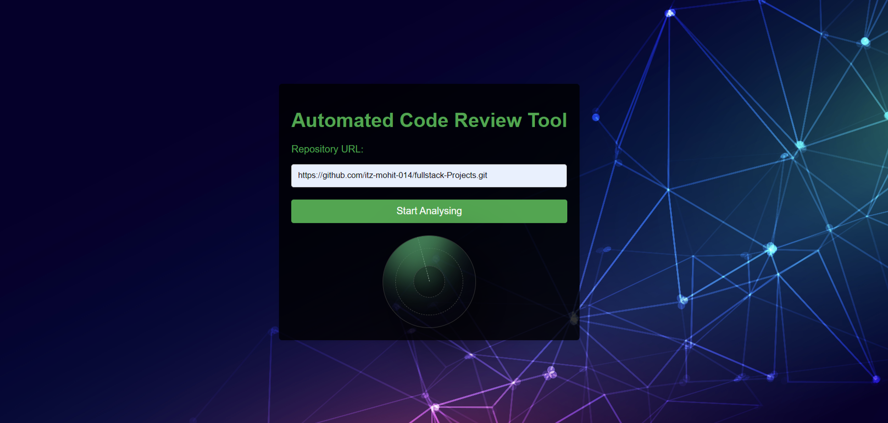
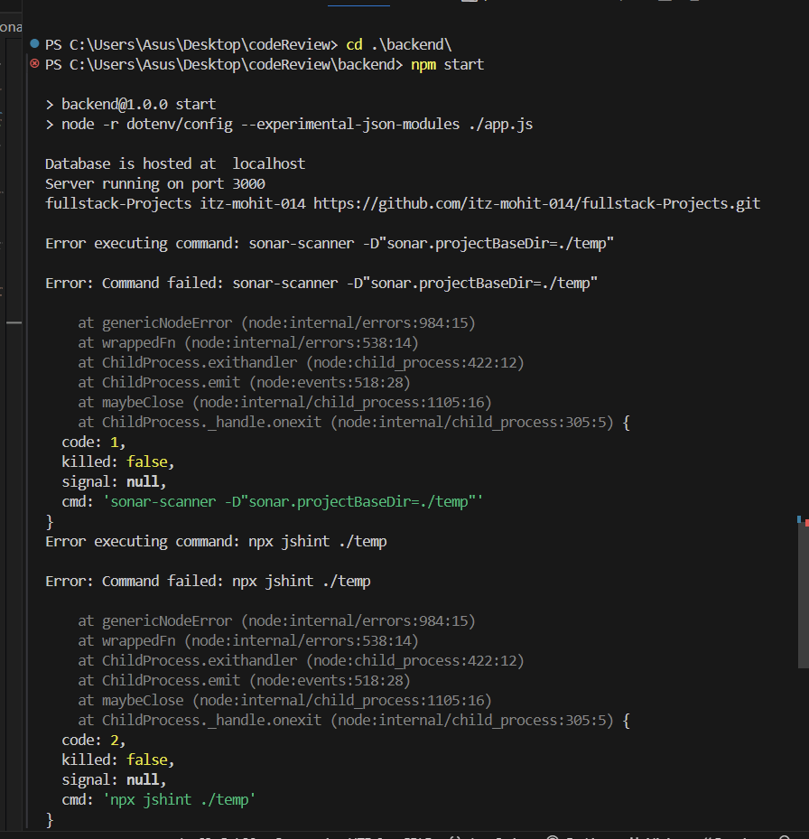
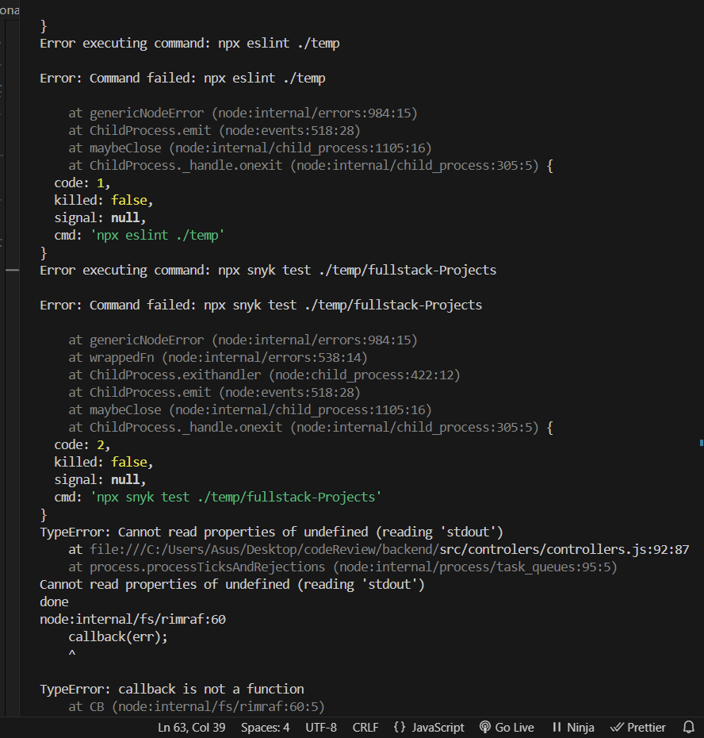
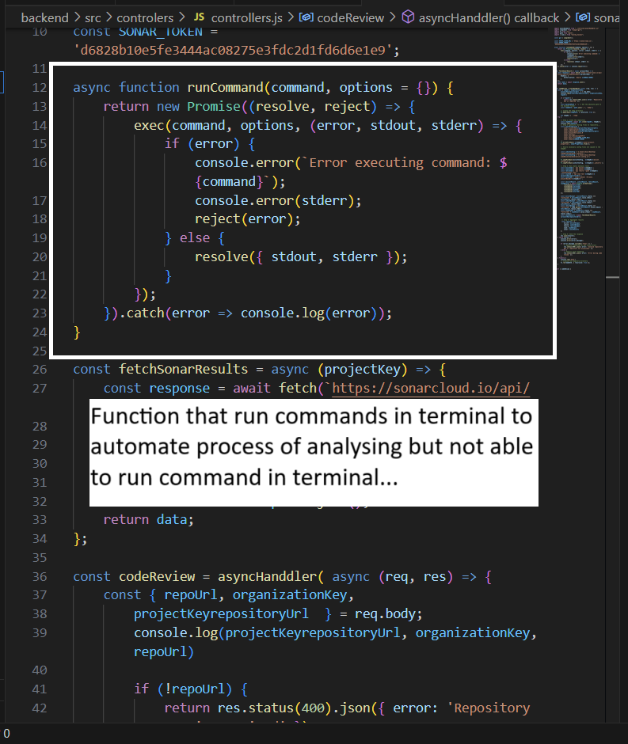

# Automated Code Review Tool

This tool helps to find error, warnings, vulnerebilities, sercurity level and full overview of the github hosted project.


## Run Locally

Clone the project

```bash
  git clone https://github.com/itz-mohit-014/Automated-Code-Review-Tool.git
```

Go to the project directory

```bash
  cd my-project
```

Change the directory

```bash
  cd ./backend/ 
```
Install server project dependencies

```bash
  npm install 
```
Change the directory to frontend

```bash
  cd ./frontend/ 
```
Install frontend project dependencies

```bash
  npm install 
```

Start the Server

```bash
  npm start 
```
View on Brower

```bash
  http://localhost:3000/ 
  
```


## Screenshots

Live View on broser...



Error Screenshot:





Controller fuction Picture: 



File Directory of Error: 

```bash

cd ./src/controlers/controllers.js

```


## Execution of project in three phase

#### Formation and linting process(Phase 1): 
Highlight errors and warnings for best code practice using ESLING MODULE

#### Static code analysing(Phase 2):
Generating report of the analysing code for best code practice along with different code version and finding errors that prevent the completion of execution to the programe using SONAR-SCANNER & JSHINT modules 

#### Security analysing(Phase 3):
find vulnerebilities issue in the code using RETIREJS & SNYK modules 


## Tech Stack

**Client:** HTML CSS JS >>> ReactJS, Redux, Tailwind

**Server:** Node, Express, MongoDB

**Main Dependencies:** SONAR-SCANNER, JSHINT, ESLINT, RETIREJS, SNYK, DEPENDENCIES-CHECK


## Features

- Analysis code that are hosted on github.
- Highlight errors and warnings
- Highlight vulnerebilities via security level Analysis
- Highlight error that cuuse prevent the execution of the code
- Interactive and Fully responsive desing


